# Functionality (for testing)

## Notifications
- On add product, notifications on day of expiry, days before expiry, and days after expiry are set, a local notification is sent on those days
- On edit product, if notifications were changed or expiry date changed, the days notifications are to be sent or not sent are updated
- On delete product, all notifications are canceled

## Login 
- Toggle password visible/not visible
- Side menu not shown
- Alert shown if could not log in
- Sign up link takes user to register page
- Successful login takes user to inventory page

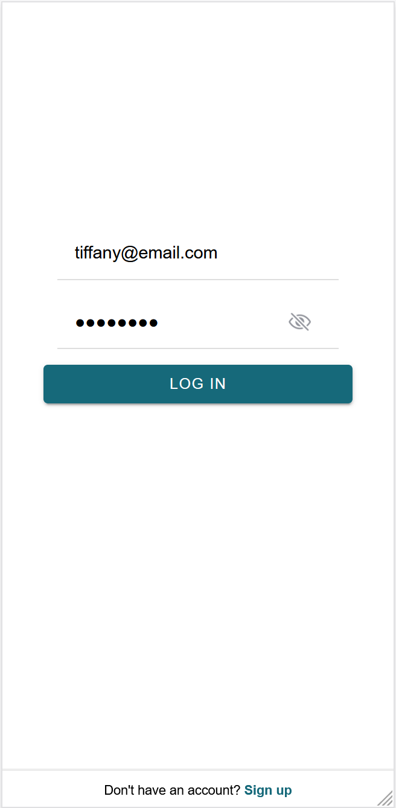

## Register
- Toggle password visible/not visible
- Side menu not shown
- All fields required
- Register button disabled until all valid information entered
- Alert shown if could not register the user
    - Same email not allowed
- Alert shown after successfully registering user, prompting to go to log in page
    - Clicking the Log In button on the alert takes the user to the log in page
- Fields are cleared only after successfully creating an account
- Log in link takes user to log in page

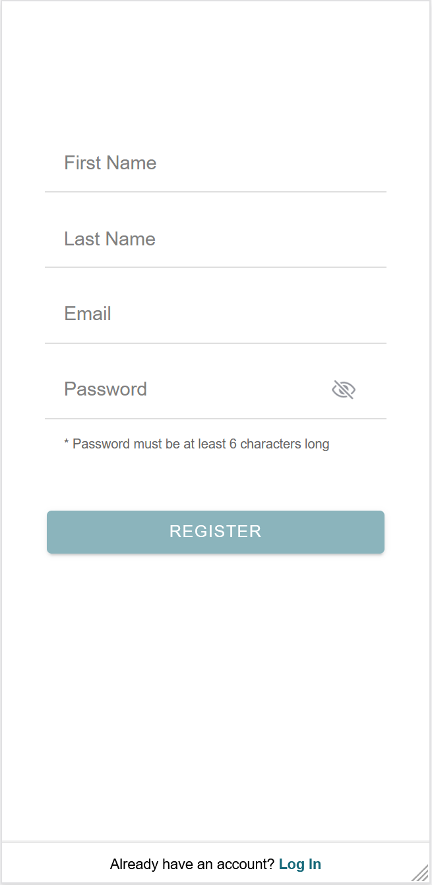

## All pages except login and register
- Redirects back to log in page if not logged in
- Only contains information for the current logged in user
- Side menu works

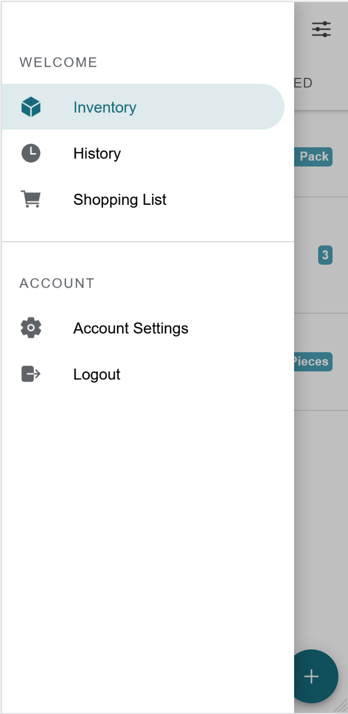

## Inventory
- Products segment shows all products that are not expired nor consumed/trashed
- Expired segment shows all products that are expired and not consumed/trashed
- Badge on each product shows the quantity
    - No unit shown if No Unit
    - Singular form used if quantity is 1, otherwise plural form (if it exists)
- Show the expiry date and notes on each product if it exists
- Filters are stored in local storage
    - If not set, by default all options are selected and sorting by expiry date, ascending
    - X button closes the filter without any change
    - Reset button clears all selections
    - Checkmark button applies the filters (and stores in local storage)
- Clicking on a product takes user to the edit product page
- Clicking the + fab button takes user to the add product page
- Toast shown if could not load products

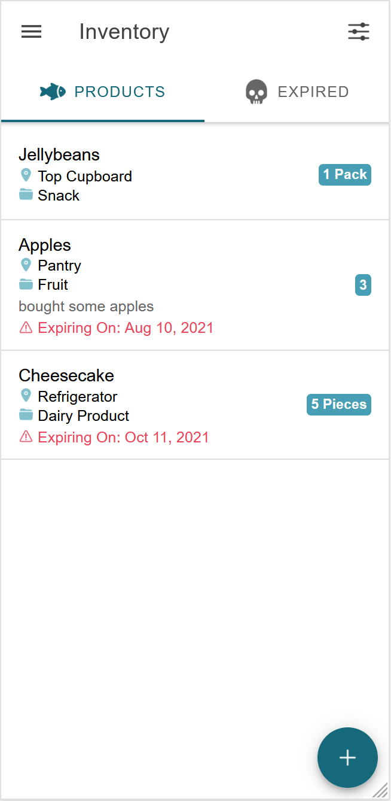 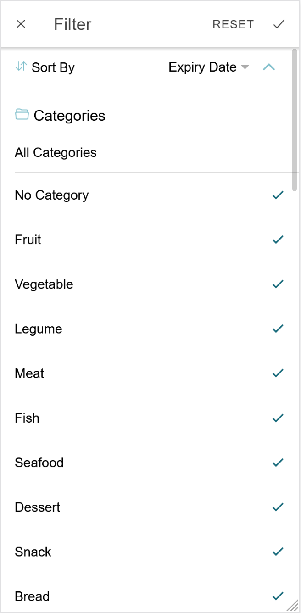

### Add Product
- Back button goes back with no changes
- Only purchase date, expiry date, notes, and days before expiry fields not required
- Add button is disabled until all required fields entered with valid information
- Purchase Date and Expiry Date have a max date of 100 years from today and min date of 100 years before today
- Unit by default is No Unit
- Category by default is No Category
- Location by default is No Location
- Add button redirects back on successful add
- Toast shown on successful and unsuccessful add

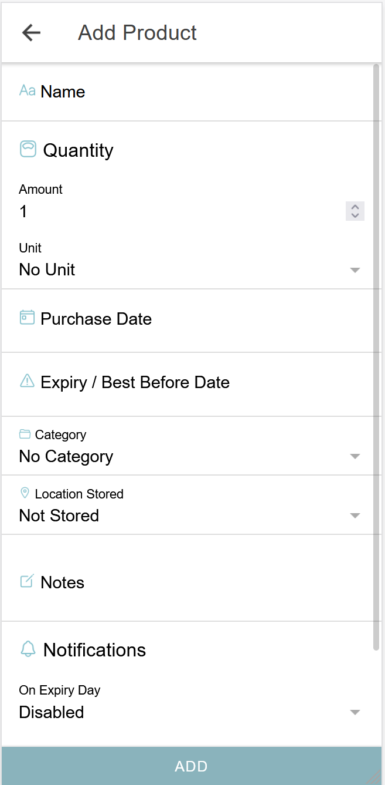

### Edit Product
- Header contains the product name
- Back button goes back with no changes
- All fields are pre-filled with current product information
- Date selectors have a max date of 100 years from today and min date of 100 years before today
- Consume/Trash buttons opens an alert prompting user for the quantity consumed/trashed
    - Cancel will close the alert with no changes
    - Confirm with a value will make the change and redirect back on successful update
      - If the quantity consumed/trashed is greater or equal to the quantity, the product is marked as consumed/trashed
    - Confirm without a value will close the alert box
- Update button is disabled if not all required fields filled
- Update button updates the product and redirects back on successful update
- Delete button shows an alert confirming delete
    - Cancel will close the alert with no changes
    - Delete will delete the product and redirect back on successful delete
- Toast shown if could not load the product
- Toast shown after every successful and unsuccessful change

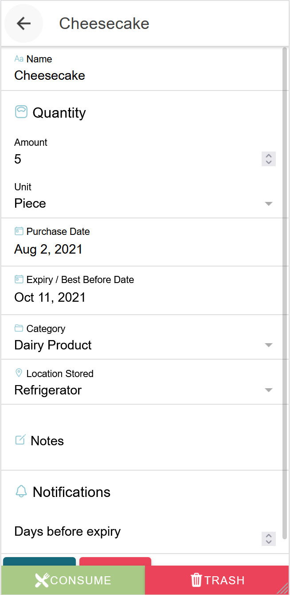

## History
- Shows all products that are consumed/trashed
- Filter works the same way as Inventory page
- Badges show quantity consumed and quantity trashed
    - No unit shown if No Unit
    - Singular form used if quantity is 1, otherwise plural form (if it exists)
- Clicking on a product redirects to view product page
- Toast shown if could not load products

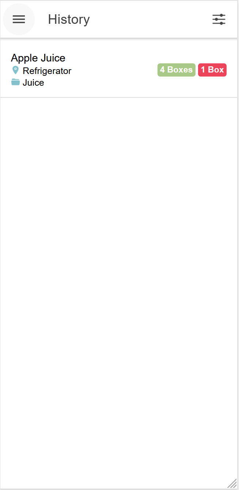

### View Product
- Header contains the product name
- Back button goes back
- Show quantity consumed and trashed
    - No unit shown if No Unit
    - Singular form used if quantity is 1, otherwise plural form (if it exists)
- Show last updated, category, and location stored
- Delete button shows an alert confirming delete
    - Cancel closes the alert with no changes
    - Confirm the product and redirects back on successful delete
- Toast shown if could not load the product
- Toast shown on successful and unsuccessful delete

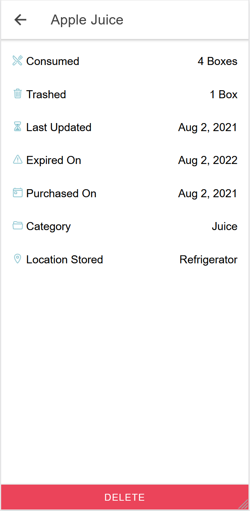

## Shopping List
- To Buy segment shows shopping items as a checklist, Archive shows cleared items
- Badge on each product shows the quantity to buy if quantity exists
    - No unit shown if No Unit
    - Singular form used if quantity is 1, otherwise plural form (if it exists)
- Show the store, price, and notes if exists
- Filters are same as inventory, but with no location options and default sorting is date created, descending
- Clicking on an item in To Buy checks it on successful update
    - On unsuccessful, toast is shown
- Clicking the fab button at the bottom shows 3 options: Add, Clear, Edit
    - Add button takes user to add item page
    - Clear button shows an alert to confirm clear
        - Cancel closes the alert box with no changes
        - Clear clears the items in To Buy to Archive
            - On unsuccessful update, toast is shown
    - Pencil button switches the view to edit view
        - Edit view removes the checkbox and on item click, takes user to edit item page
        - The pencil icon is then replaced with a checkbox icon
            - When checkbox icon is clicked, view switches back to checklist and the icon is back to a pencil
- Clicking on an item in Archive or in To Buy edit mode takes user to edit item page
- Toast is shown if could not load items

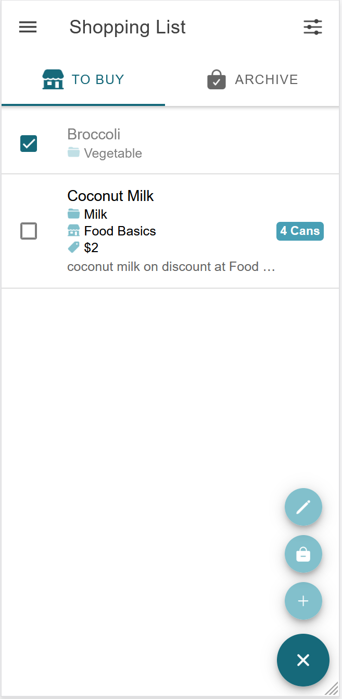

### Add Item
- Back button redirects back
- Only name and category required
- Category is No Category by default
- Add button is disabled until all required fields are filled and valid
- Toast shown on successful and unsuccessful add

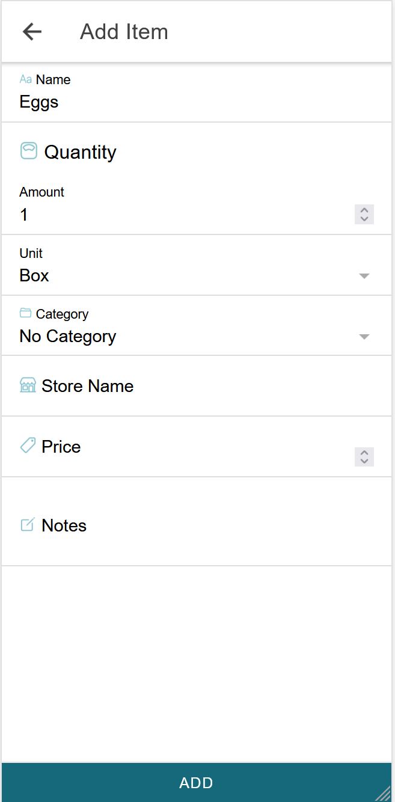

### Edit Item
- Back button redirects back
- All fields are pre-filled with current item information
- Update button is disabled if not all required fields filled
- Update button updates the item and redirects back on successful update
- Delete button shows an alert confirming delete
    - Cancel will close the alert with no changes
    - Delete will delete the item and redirect back on successful delete
- Toast shown if could not load the item
- Toast shown on successful and unsuccessful update and delete

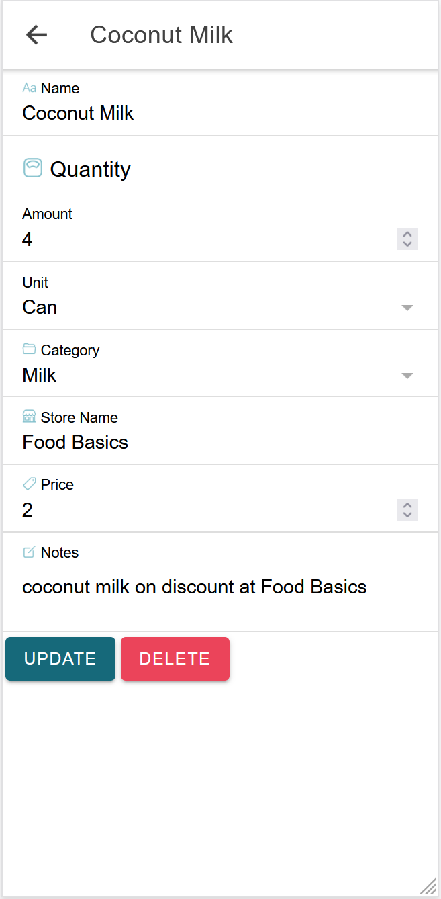

## Account Settings
- Pre-filled with current user information, except password
- Update buttons disabled if not fields not filled in and invalid
- Toggle password visible/not visible for both password fields
- Update password unsuccessful if current password is incorrect
- Alert on unsuccessful updates
- Toast on successful updates

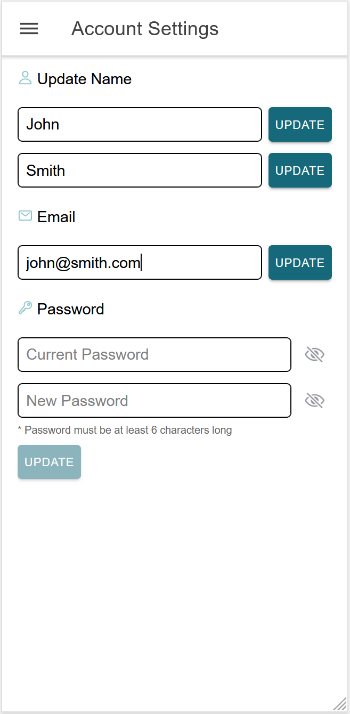

## Logout
- Log out current user and redirects to log in page
